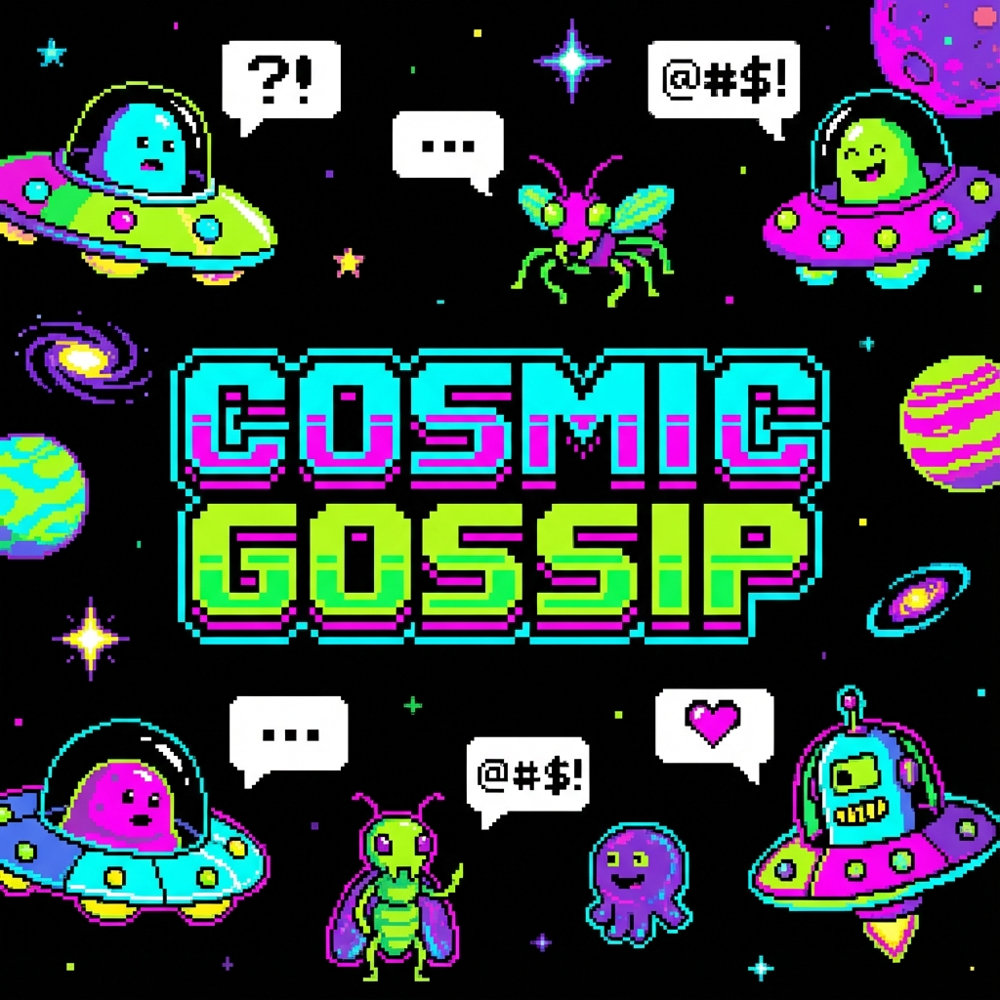

# Cosmic Gossip 🛸💬

**Cosmic Gossip** is a twist on the classic Space Invaders. Instead of just mindlessly attacking, these aliens have lives, opinions, and a lot to say!

Powered by the **Google Gemini API**, they banter about everything from intergalactic rent prices to today's weirdest Earth news. Watch them gossip, argue, and even beg for mercy as you blast them away.

## ✨ Features

*   👾 **Dynamic Alien Banter:** Aliens chat with each other in real-time using AI.
*   📰 **News-Aware:** They react to real-world current events (when connected).
*   😱 **Emotional AI:** The last survivor will panic and beg for their life.
*   🎹 **Retro Vibes:** Custom pixel art and synthesized Web Audio sound effects.
*   🔌 **Offline Mode:** Playable without an API key using a massive cache of jokes.

## 🚀 How to Play

1.  **Start the Game:** Open `index.html` in your browser.
2.  **API Key (Optional):** Enter your Google Gemini API key for fresh, dynamic banter.
3.  **Offline Mode:** Click "PLAY OFFLINE" to play with the built-in joke library.
4.  **Controls:**
    *   **Arrow Keys / A & D:** Move Left/Right
    *   **Space / Enter:** Shoot
5.  **Objective:** Destroy all aliens before they reach the bottom!

## 🛠️ Technologies

*   HTML5 Canvas
*   Vanilla JavaScript (ES6+)
*   Web Audio API
*   Google Gemini API

## 🤝 Contributing

Contributions are what make the open source community such an amazing place to learn, inspire, and create. Any contributions you make are **greatly appreciated**.

1.  Fork the Project
2.  Create your Feature Branch (`git checkout -b feature/AmazingFeature`)
3.  Commit your Changes (`git commit -m 'Add some AmazingFeature'`)
4.  Push to the Branch (`git push origin feature/AmazingFeature`)
5.  Open a Pull Request

## 📜 License

Distributed under the MIT License. See `LICENSE` for more information.

## 👤 Author

**the3y3-code**

*   GitHub: [@the3y3-code](https://github.com/the3y3-code)
